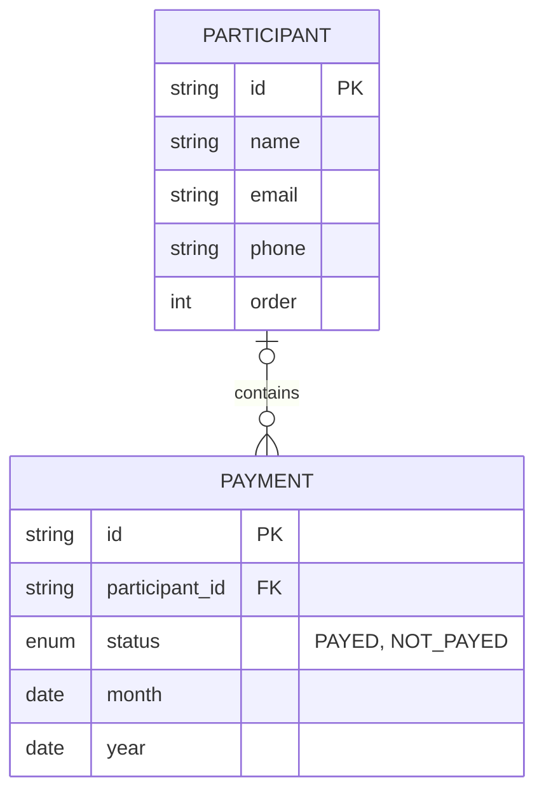

# Database diagram

```mermaid
erDiagram
    PARTICIPANT o|--o{ PAYMENT : contains

    PARTICIPANT {
        string id PK
        string name
        string email
        string phone
        int order
    }

    PAYMENT {
        string id PK
        string participant_id FK
        enum status "PAYED, NOT_PAYED"
        date month
        date year
    }
```