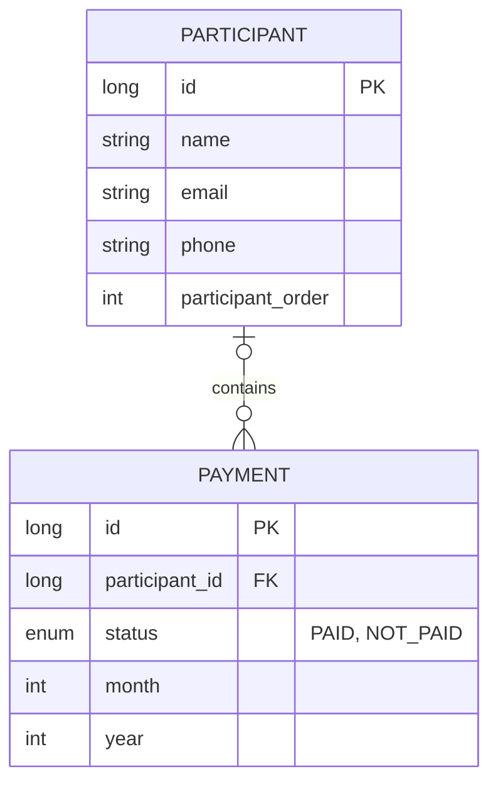

# Database diagram

```mermaid
erDiagram
    PARTICIPANT o|--o{ PAYMENT : contains

    PARTICIPANT {
        long id PK
        string name
        string email
        string phone
        int participant_order
    }

    PAYMENT {
        long id PK
        long participant_id FK
        enum status "PAID, NOT_PAID"
        int month
        int year
    }
```